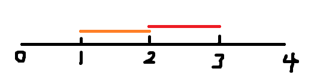

# 4

## 题目描述

牛牛刚刚得知牛牛所在的街道上有一个人Pid得了新型冠状病毒！！！他想知道这条街上最多多少人可能得了新型冠状病毒？给出每个人在街道上的活动区域Pos。只要在得了冠状病毒的人的活动范围内活动就可能被染上冠状病毒！因为情况紧急，所以牛牛想请你帮忙快速计算下究竟最坏情况下会有多少人感染上冠状病毒？

# 输入描述:
给定Pid与Pos数组

第$i$个人的活动范围为[Pos[i].x,Pos[i].y];

$0 \leq Pid < Pos.size \leq 5*10^5$

$1 \leq Pos[i].x \leq Pos[i].y \leq 10^5$

# 输出描述:
返回最坏情况下人感染上冠状病毒的人数

# 示例1

## 输入
1,[(1,2),(2,3)]

## 输出
2

## 说明

最坏情况下两人都感染

# 示例2

## 输入

1,[(1,2),(3,4)]

## 输出

1

## 说明

最坏情况下只有一个人被感染

