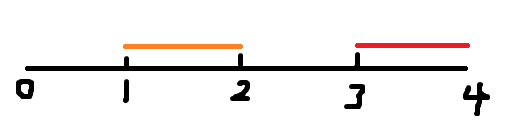

# 1

## 题目描述

输入一个整形数组（可能有正数和负数），求数组中连续子数组（最少有一个元素）的最大和。要求时间复杂度为O(n)。

## 输入描述:

第一行为数组的长度N（N>=1），接下来N行，每行一个数，代表数组的N个元素

## 输出描述:

最大和的结果

## 示例1

### 输入

8

1

-2

3

10

-4

7

2

-5

### 输出

18

### 说明

最大子数组为 3, 10, -4, 7, 2

# 2 

## 题目描述

Shopee物流会有很多个中转站。在选址的过程中，会选择离用户最近的地方建一个物流中转站。

假设给你一个二维平面网格，每个格子是房子则为1，或者是空地则为0。找到一个空地修建一个物流中转站，使得这个物流中转站到所有的房子的距离之和最小。 能修建，则返回

最小的距离和。如果无法修建，则返回 -1。

若范围限制在100*100以内的网格，如何计算出最小的距离和？

当平面网格非常大的情况下，如何避免不必要的计算？

## 输入描述:

4

0 1 1 0

1 1 0 1

0 0 1 0

0 0 0 0

先输入方阵阶数，然后逐行输入房子和空地的数据，以空格分隔。

## 输出描述:

8

## 说明

能修建，则返回最小的距离和。如果无法修建，则返回 -1。

## 示例1

### 输入

4

0 1 1 0

1 1 0 1

0 0 1 0

0 0 0 0

### 输出

8

## 示例2

### 输入

4

1 1 1 1

1 1 1 1

1 1 1 1

1 1 1 1

### 输出

-1

# 3

## 题目描述

在Linux Shell命令下通配符'*'表示0个或多个字符, 现编写一段代码实现通配符'*'的功能，注意只需要实现'*', 不用实现其他通配符。

# 输入描述:

第一行输入通配字符串

第二行输入要匹配查找的字符串

# 输出描述:

输出所有匹配的字串起始位置和长度，每行一个匹配输出

如果不匹配，则输出 -1 0

如果有多个按照起始位置和长度的正序输出。

# 示例1

## 输入

shopee*.com

shopeemobile.com

## 输出

0 16

## 说明

0 起始位置，16长度

# 示例2

## 输入

*.com

shopeemobile.com

## 输出

0 16

1 15

2 14

3 13

4 12

5 11

6 10

7 9

8 8

9 7

10 6

11 5

12 4

# 示例3

## 输入

o*m

shopeemobile.com

## 输出

2 5

2 14

7 9

14 2

# 4

## 题目描述

牛牛刚刚得知牛牛所在的街道上有一个人Pid得了新型冠状病毒！！！他想知道这条街上最多多少人可能得了新型冠状病毒？给出每个人在街道上的活动区域Pos。只要在得了冠状病毒的人的活动范围内活动就可能被染上冠状病毒！因为情况紧急，所以牛牛想请你帮忙快速计算下究竟最坏情况下会有多少人感染上冠状病毒？

# 输入描述:
给定Pid与Pos数组

第$i$个人的活动范围为[Pos[i].x,Pos[i].y];

$0 \leq Pid < Pos.size \leq 5*10^5$

$1 \leq Pos[i].x \leq Pos[i].y \leq 10^5$

# 输出描述:
返回最坏情况下人感染上冠状病毒的人数

# 示例1

## 输入
1,[(1,2),(2,3)]

## 输出
2

## 说明

最坏情况下两人都感染

# 示例2

## 输入

1,[(1,2),(3,4)]

## 输出

1

## 说明

最坏情况下只有一个人被感染

***

<!-- # 

## 题目描述

# 输入描述:

# 输出描述:

# 示例1

## 输入

## 输出 -->
